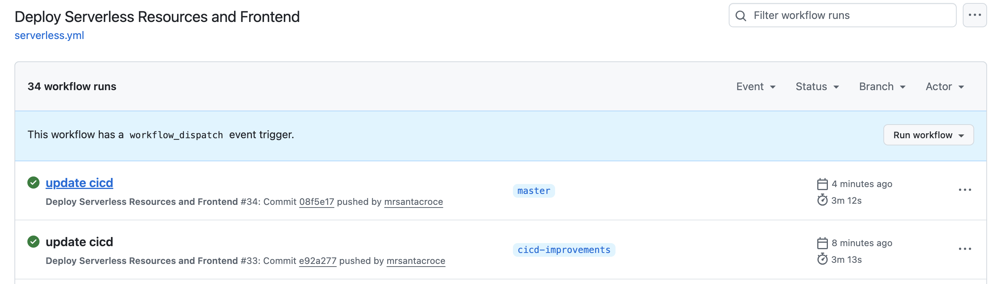
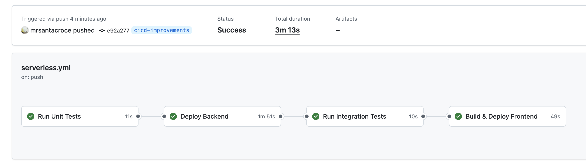
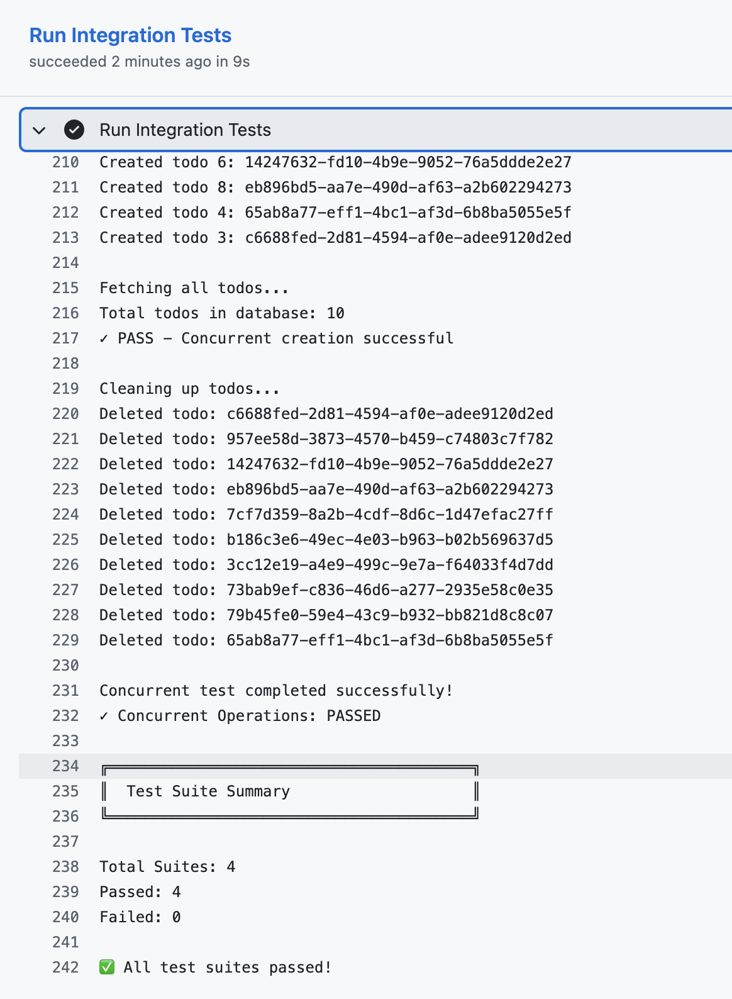

# Serverless Fullstack Todo Application

A production-ready, serverless todo application built with AWS Lambda, API Gateway, DynamoDB, and React. Features multi-stage deployments, comprehensive testing, and automated CI/CD pipeline.

**Live Prod Application:** [https://d3f3z8uaga4kw3.cloudfront.net/](https://d3f3z8uaga4kw3.cloudfront.net/)

**Video Walkthrough:** [A Loom video walkthrough covering:](https://www.loom.com/share/0e275145c7f945b9aa97e8f188c1d608?sid=e730bff5-cf54-417c-a85a-de67c650749b)
- Application architecture and design decisions
- Code organization and best practices
- Infrastructure as Code with Serverless Framework
- CI/CD pipeline demonstration
- Testing strategy
- Live application demo

**NOTES**
- Next steps would be implementing Cognito functionality and improving the frontend and integration tests to account for this.

---

## 📋 Table of Contents
- [Architecture](#architecture)
- [Features](#features)
- [Tech Stack](#tech-stack)
- [Quick Start](#quick-start)
- [Project Structure](#project-structure)
- [API Documentation](#api-documentation)
- [Testing](#testing)
- [CI/CD Pipeline](#cicd-pipeline)
- [Deployment](#deployment)
- [Environment Variables](#environment-variables)

---

## 🏗️ Architecture

```
┌─────────────────────────────────────────────────────────────────┐
│                          CloudFront CDN                         │
│                   (d3f3z8uaga4kw3.cloudfront.net)               │
└────────────────────────┬────────────────────────────────────────┘
                         │
                         ▼
                  ┌──────────────┐
                  │   S3 Bucket   │
                  │ (React Build) │
                  └──────────────┘
                         │
                         │ API Calls
                         ▼
┌────────────────────────────────────────────────────────────────────┐
│                       API Gateway (REST)                           │
│         https://jsvqqyg2k5.execute-api.us-east-1.amazonaws.com/prod│
└────────────┬───────────────────────────────────────────────────────┘
             │
             ▼
    ┌────────────────┐
    │ Lambda Functions│
    ├────────────────┤
    │ • create       │
    │ • list         │
    │ • get          │
    │ • update       │
    │ • delete       │
    └────────┬───────┘
             │
             ▼
      ┌─────────────┐
      │  DynamoDB   │
      │   Table     │
      └─────────────┘
```

### Infrastructure Components:
- **Frontend**: React (Next.js) with Tailwind CSS, hosted on S3 + CloudFront
- **Backend**: 5 AWS Lambda functions (Node.js 20.x)
- **API**: AWS API Gateway REST API with CORS support
- **Database**: DynamoDB (Pay-per-request billing)
- **CDN**: CloudFront distribution for global content delivery
- **IaC**: Serverless Framework v4

---

## ✨ Features

### Backend
- ✅ RESTful API with full CRUD operations
- ✅ Input validation and sanitization
- ✅ Proper HTTP status codes (200, 400, 404, 500)
- ✅ CORS configuration for cross-origin requests
- ✅ API Gateway throttling (100 req/s, 200 burst)
- ✅ Individual Lambda packaging for optimal performance
- ✅ Comprehensive error handling

### Frontend
- ✅ Modern, responsive UI with Tailwind CSS
- ✅ Custom modals (no default browser dialogs)
- ✅ Real-time validation with character count
- ✅ Optimistic UI updates
- ✅ Keyboard shortcuts (ESC to close modals)
- ✅ Mobile-first responsive design (4+ breakpoints)
- ✅ Accessibility features (ARIA labels, semantic HTML)

### Testing
- ✅ 17 unit tests (Jest)
- ✅ 4 integration test suites:
  - Basic CRUD operations
  - Input validation & error handling
  - CORS headers verification
  - Concurrent operations

### DevOps
- ✅ Multi-stage deployments (dev/prod)
- ✅ Automated CI/CD with GitHub Actions
- ✅ Automated testing in pipeline
- ✅ CloudFront cache invalidation

---

## 🛠️ Tech Stack

### Backend
- **Runtime**: Node.js 20.x
- **Framework**: Serverless Framework 4.x
- **Language**: JavaScript
- **Database**: AWS DynamoDB
- **API**: AWS API Gateway (REST)
- **Compute**: AWS Lambda

### Frontend
- **Framework**: React 19.1.0 (Next.js 15.5.4)
- **Language**: TypeScript
- **Styling**: Tailwind CSS 4.x
- **Build Tool**: Turbopack
- **Hosting**: AWS S3 + CloudFront

### Testing
- **Unit Tests**: Jest 29.x
- **Integration Tests**: Bash scripts with curl
- **Coverage**: Functions, validation, CORS, concurrency

### CI/CD
- **Pipeline**: GitHub Actions
- **Deployment**: Serverless Framework CLI
- **Automation**: Multi-stage (dev/prod)

---

## 🚀 Quick Start

### Prerequisites
- Node.js 20.x or higher
- AWS Account with credentials configured
- Serverless Framework installed globally (optional)

### Installation

1. **Clone the repository**
   ```bash
   git clone https://github.com/mrsantacroce/serverless-fullstack-react-app.git
   cd serverless-fullstack-react-app
   ```

2. **Install backend dependencies**
   ```bash
   npm install
   ```

3. **Install frontend dependencies**
   ```bash
   cd client
   npm install
   cd ..
   ```

4. **Configure AWS credentials**
   ```bash
   aws configure
   # Enter your AWS Access Key ID, Secret Access Key, and region
   ```

5. **Deploy to dev stage**
   ```bash
   npx serverless deploy --stage dev
   ```

6. **Get the API endpoint**
   ```bash
   npx serverless info --stage dev
   # Copy the API Gateway endpoint URL
   ```

7. **Build and deploy frontend**
   ```bash
   cd client
   echo "NEXT_PUBLIC_API_URL=<your-api-endpoint>" > .env.production
   npm run build

   # Get S3 bucket name from deployment outputs
   aws s3 sync out/ s3://<bucket-name> --delete

   # Get CloudFront distribution ID and invalidate cache
   aws cloudfront create-invalidation --distribution-id <dist-id> --paths "/*"
   ```

8. **Access the application**
   - Frontend: Check CloudFront URL in deployment outputs
   - API: Use the API Gateway endpoint from step 6

---

## 📁 Project Structure

```
serverless-fullstack-react-app/
├── .github/
│   └── workflows/
│       └── serverless.yml          # GitHub Actions CI/CD pipeline
├── client/                         # Next.js React frontend
│   ├── app/
│   │   ├── layout.tsx             # Root layout with metadata
│   │   └── page.tsx               # Main todo page
│   ├── components/
│   │   ├── AddTodo.tsx            # Create todo component
│   │   ├── TodoItem.tsx           # Individual todo with edit/delete
│   │   └── TodoList.tsx           # Todo list container
│   ├── lib/
│   │   └── validation.ts          # Frontend validation logic
│   ├── .env.local                 # Local development API URL
│   ├── .env.production            # Production API URL
│   └── package.json
├── src/
│   ├── functions/
│   │   ├── create.js              # POST /todos
│   │   ├── list.js                # GET /todos
│   │   ├── get.js                 # GET /todos/{id}
│   │   ├── update.js              # PUT /todos/{id}
│   │   ├── delete.js              # DELETE /todos/{id}
│   │   └── dynamodb.js            # DynamoDB client setup
│   └── __tests__/
│       ├── create.test.js         # Unit tests for create
│       ├── list.test.js           # Unit tests for list
│       ├── update.test.js         # Unit tests for update
│       └── delete.test.js         # Unit tests for delete
├── utils/
│   ├── test-api.sh                # Basic CRUD integration tests
│   ├── test-validation.sh         # Validation & error handling tests
│   ├── test-cors.sh               # CORS header tests
│   ├── test-concurrency.sh        # Concurrent operations tests
│   └── run-all-tests.sh           # Test suite runner
├── serverless.yml                 # Serverless Framework configuration
├── package.json                   # Backend dependencies
└── jest.config.js                 # Jest configuration
```

---

## 📡 API Documentation

**Base URL (Dev):** `https://n90t8ca9vi.execute-api.us-east-1.amazonaws.com/dev`

### Endpoints

#### Create Todo
```http
POST /todos
Content-Type: application/json

{
  "text": "Buy groceries"
}
```

**Response (200)**
```json
{
  "id": "uuid-v4",
  "text": "Buy groceries",
  "checked": false,
  "createdAt": 1234567890,
  "updatedAt": 1234567890
}
```

**Validation**
- `text` is required and must be a string
- `text` cannot be empty or whitespace only
- `text` must be ≤ 500 characters

---

#### List All Todos
```http
GET /todos
```

**Response (200)**
```json
[
  {
    "id": "uuid-v4",
    "text": "Buy groceries",
    "checked": false,
    "createdAt": 1234567890,
    "updatedAt": 1234567890
  }
]
```

---

#### Get Single Todo
```http
GET /todos/{id}
```

**Response (200)**
```json
{
  "id": "uuid-v4",
  "text": "Buy groceries",
  "checked": false,
  "createdAt": 1234567890,
  "updatedAt": 1234567890
}
```

**Response (404)** - Todo not found

---

#### Update Todo
```http
PUT /todos/{id}
Content-Type: application/json

{
  "text": "Buy groceries and milk",
  "checked": true
}
```

**Response (200)**
```json
{
  "id": "uuid-v4",
  "text": "Buy groceries and milk",
  "checked": true,
  "createdAt": 1234567890,
  "updatedAt": 1234567899
}
```

**Response (404)** - Todo not found

**Validation**
- `text` must be a string
- `checked` must be a boolean
- Same text validation as create

---

#### Delete Todo
```http
DELETE /todos/{id}
```

**Response (200)**
```json
{
  "message": "Todo item deleted successfully."
}
```

**Response (404)** - Todo not found

---

### Error Responses

#### 400 Bad Request
```json
{
  "error": "Todo text cannot be empty"
}
```

#### 404 Not Found
```json
{
  "error": "Todo item not found"
}
```

#### 500 Internal Server Error
```json
{
  "error": "Couldn't create the todo item."
}
```

---

## 🧪 Testing

### Unit Tests
Run Jest unit tests for Lambda functions:
```bash
npm test                    # Run all tests
npm run test:watch          # Run in watch mode
```

**Coverage**: 17 tests across 4 files
- Create function tests
- List function tests
- Update function tests (including 404 handling)
- Delete function tests (including 404 handling)

### Integration Tests
Run comprehensive integration tests against deployed API:

```bash
# Set API endpoint
export API_ENDPOINT=https://your-api-endpoint.com/dev

# Run all integration test suites
npm run test:integration

# Or run individual test suites
npm run test:api           # Basic CRUD operations
npm run test:validation    # Input validation & errors
npm run test:cors          # CORS headers
npm run test:concurrency   # Concurrent operations
```

**Test Coverage:**
- ✅ CRUD operations (create, read, update, delete)
- ✅ Input validation (empty, whitespace, length, types)
- ✅ Error handling (404, 400, 500)
- ✅ CORS configuration
- ✅ Concurrent requests
- ✅ Edge cases (exactly 500 chars)

---

## 🔄 CI/CD Pipeline

### GitHub Actions Workflow

**Trigger**: Push to any branch
- **Non-master branches** → Deploy to `dev` stage
- **Master branch** → Deploy to `prod` stage

### Pipeline Steps

1. **Checkout Code**
2. **Setup Node.js 20.x**
3. **Install Dependencies**
4. **Validate Configuration** (`serverless print`)
5. **Deploy Backend** (Lambda + API Gateway + DynamoDB)
6. **Run Integration Tests** (all 4 test suites)
7. **Build Frontend** (Next.js with stage-specific API URL)
8. **Deploy Frontend** (S3 sync)
9. **Invalidate CloudFront Cache**
10. **Display URLs** (Frontend + API endpoints)

### CI/CD Screenshots

#### GitHub Actions Workflow


#### Successful Deployment


#### Integration Tests Passing


---

## 🚢 Deployment

### Manual Deployment

#### Deploy Backend
```bash
# Deploy to dev
npx serverless deploy --stage dev

# Deploy to prod
npx serverless deploy --stage prod

# View deployment info
npx serverless info --stage dev
```

#### Deploy Frontend
```bash
cd client

# Set API endpoint
echo "NEXT_PUBLIC_API_URL=<api-endpoint>" > .env.production

# Build
npm run build

# Deploy to S3
aws s3 sync out/ s3://<bucket-name> --delete

# Invalidate CloudFront
aws cloudfront create-invalidation \
  --distribution-id <dist-id> \
  --paths "/*"
```

### Automated Deployment (GitHub Actions)

Simply push to your branch:
```bash
git add .
git commit -m "Your changes"
git push origin your-branch    # Deploys to dev
git push origin master         # Deploys to prod
```

---

## 🔐 Environment Variables

### Backend (Serverless Framework)
Set in `serverless.yml`:
- `DYNAMODB_TABLE`: DynamoDB table name (auto-generated per stage)
- `MAX_TODO_LENGTH`: Maximum todo text length (500)

### Frontend (Next.js)
Set in `.env.production`:
- `NEXT_PUBLIC_API_URL`: API Gateway endpoint URL

### CI/CD (GitHub Secrets)
Required secrets in GitHub repository settings:
- `AWS_ACCESS_KEY_ID`: AWS access key
- `AWS_SECRET_ACCESS_KEY`: AWS secret key
- `SERVERLESS_ACCESS_KEY`: Serverless Framework access key

---

## 🎯 Multi-Stage Configuration

### Stages
- **dev**: Development environment (any branch except master)
- **prod**: Production environment (master branch only)

### Stage-Specific Resources
Each stage gets its own:
- DynamoDB table (`serverless-fullstack-react-app-{stage}`)
- Lambda functions
- API Gateway endpoint
- S3 bucket for frontend
- CloudFront distribution

### CORS Configuration
- **dev**: `*` (allow all origins)
- **prod**: `https://d343w4jgkgubbi.cloudfront.net` (specific domain)

---

## 📝 Additional Features Implemented

### Lambda Packaging Optimization
- Individual packaging per function (smaller deployment sizes)
- Exclusion of dev dependencies and test files
- Faster cold starts

### Security Best Practices
- Input validation on all endpoints
- SQL injection prevention (DynamoDB)
- XSS prevention (React escaping)
- Rate limiting (100 req/s, 200 burst)
- CORS configuration

### Error Handling
- Proper 404 responses for non-existent resources
- Validation errors with descriptive messages
- Database error handling
- Frontend error state management

---

## 📚 References

- [Serverless Framework Documentation](https://www.serverless.com/framework/docs)
- [AWS Lambda Best Practices](https://docs.aws.amazon.com/lambda/latest/dg/best-practices.html)
- [Next.js Documentation](https://nextjs.org/docs)
- [DynamoDB Documentation](https://docs.aws.amazon.com/dynamodb/)
- [GitHub Actions Documentation](https://docs.github.com/en/actions)
- [Serverless GitHub Deployment](https://github.com/serverless/github-action)
- [Node API on Serverless with DynamoDB](https://github.com/serverless/examples/tree/master/aws-node-rest-api-with-dynamodb-and-offline)

---

**Challenge Source**: [Serverless Guru Code Challenge #6](https://github.com/serverless-guru/code-challenges/tree/master/code-challenge-6)

Built as a code challenge demonstration for Serverless Guru.

---

## 📄 License

This project is open source and available for educational purposes.
